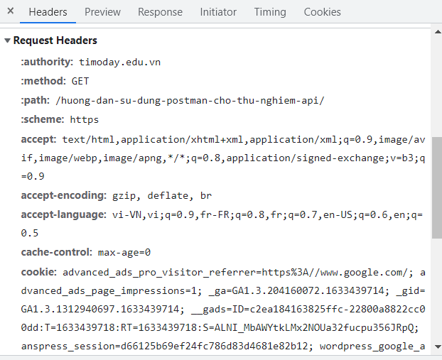
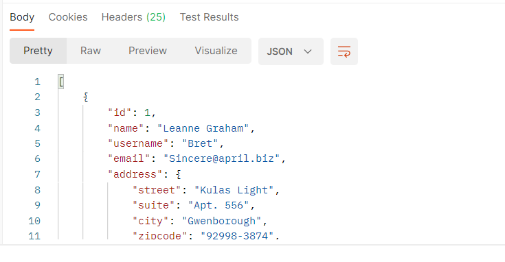

**Tìm hiểu về RESFUL API và ví dụ**

**Định nghĩa API:** API là viết tắt của Application Programming Interface là tập các quy tắc cho phép các chương trình giao tiếp với nhau. Hiểu đơn giản thì API là ngôn ngữ, phương thức trung gian, tiếng nói chung để front-end và back-end hiểu nhau, giao tiếp và trao đổi dữ liệu với nhau.

**Định nghĩa và cách thiết kế RESFUL API:**

Restful API được xây dựng trên giao thức HTTP là một chuẩn để thiết kế API cho các ứng dụng web để tiện cho việc quản lý các resoure giúp front và back dễ dàng tìm được tiếng nói chung. 

**Restful Api có 4 thành phần chính trong một request:**

- Endpoint (url)
- Method (phương thức)
- Header
- Body (data)

**ENDPOINT:**

-Là đường URL mà Client gửi yêu cầu lên

-Ví dụ về endpoint: <https://www.facebook.com/groups/feed/> 

**METHOD ( PHƯƠNG THỨC ):**

- **GET**: truy xuất resource và trả về resource yêu cầu ở phần body của response message cho client.
- **POST**: tạo 1 resource mới, thông tin của resource mới được chứa ở body của request message. POST cũng được dùng để kích hoạt các chức năng mà
  không tạo resource.
- **PUT**: tạo mới hoặc thay đổi resource, phần body của request message chứa resource cần tạo hoặc thay đổi
- **PATCH**: cập nhật một phần tài nguyên, phần request body chứa cụ thể phần cần cập nhật của resource.
- **DELETE**: xóa resource

**HEADERS**

-Là tiêu đề của yêu cầu cung cấp thông tin cho client và server

-Ví dụ về headers:

**BODY**

-Body chưa tất cả thông tin mà client muốn gửi cho server

-Ví dụ:

**HTTP STATUS CODE**

HTTP status code là yếu tố quan trọng trong
HTTP message response được server trả về cho
client

Một số Respone thường găp:

\+ 200 OK: yêu cầu được đáp ứng và dữ liệu được yêu cầu nằm trong bản tin

\+ 400 Bad Request: Server không hiểu được yêu cầu của client

\+ 401 Unauthorized – Request cần có auth.

\+ 404 Not found: đối tượng không được lưu trên máy chủ ( không tìm thấy)

\+ 505 HTTP version not support: máy chủ không hỗ trợ giao thức của máy khách

