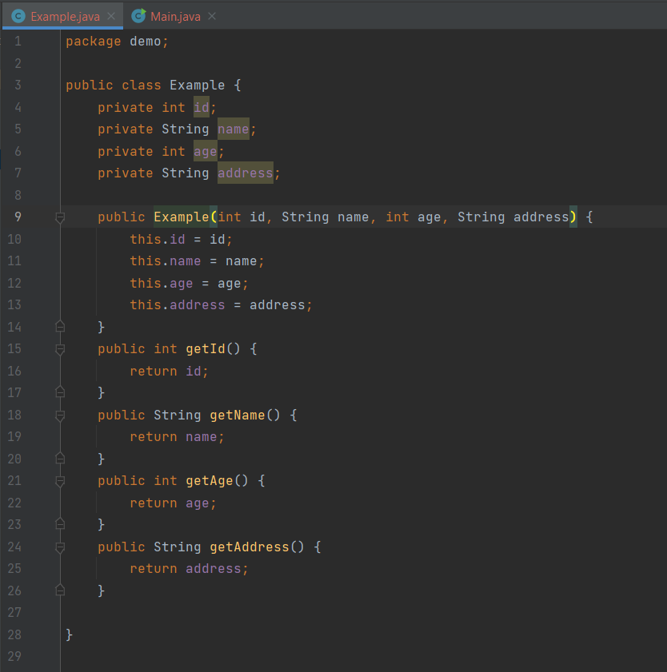
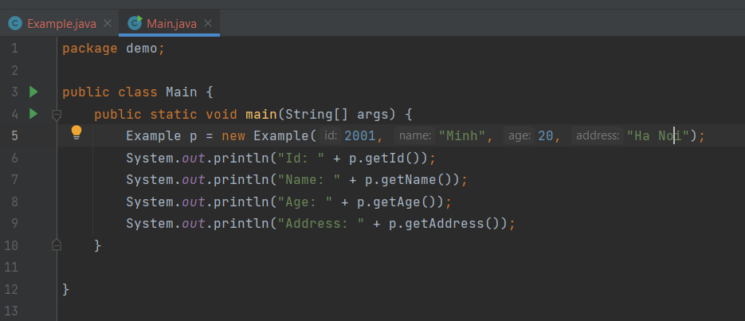
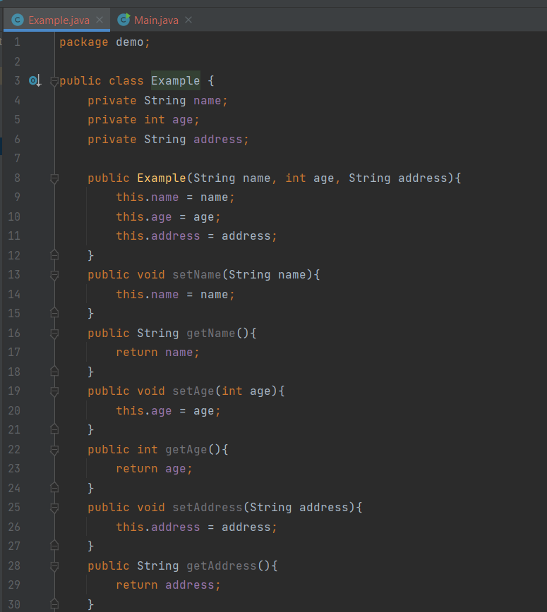
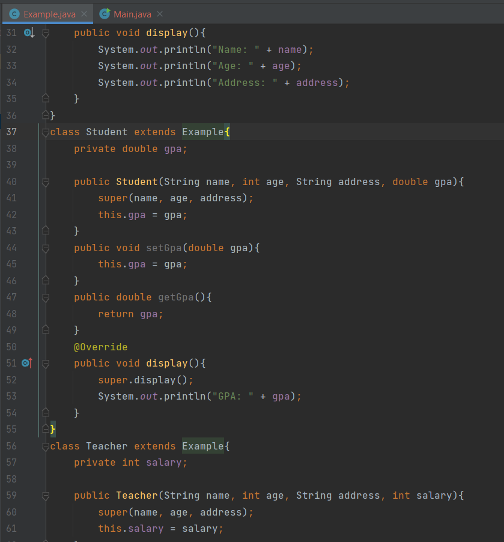
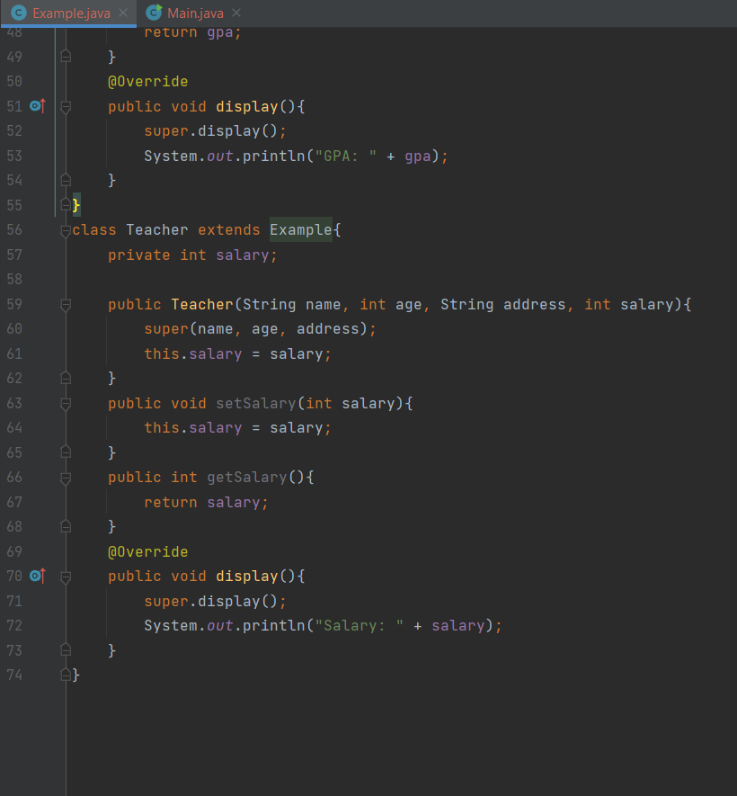
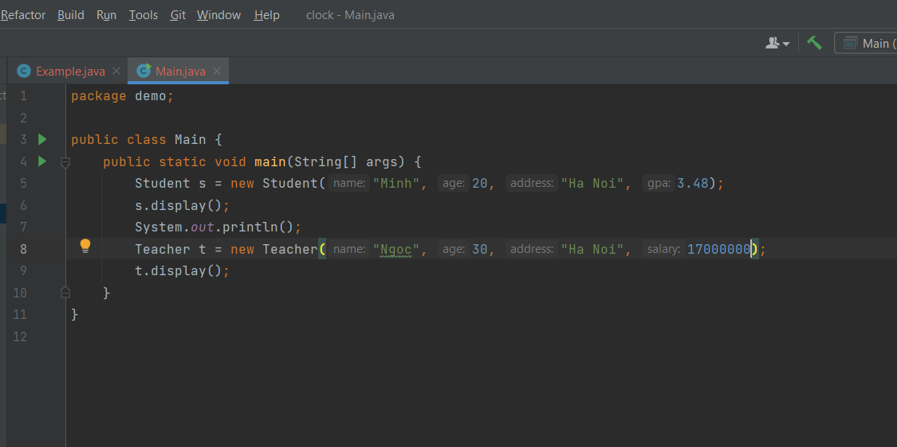
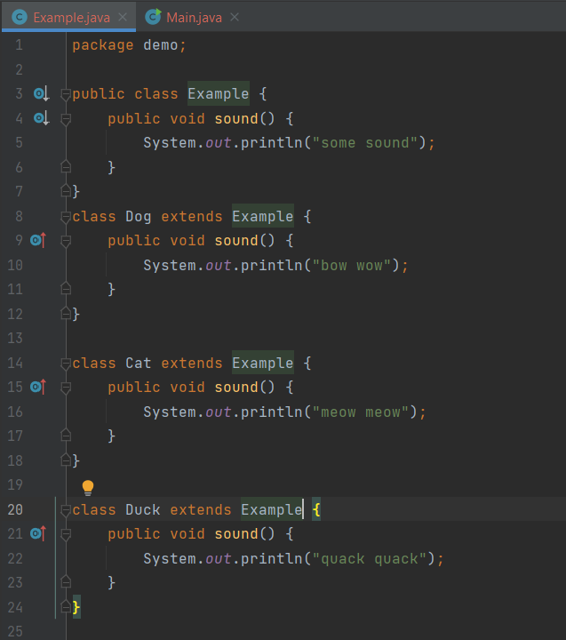
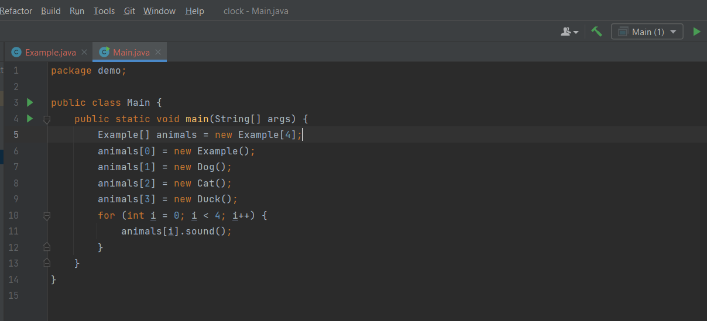

**Bài tập oop (buổi 5)**

**A.Trình bày 4 đặc tính cơ bản của OOP**

**1. Tính đóng gói**

-Tính đóng gói là kỹ thuật giúp che giấu thông tin và những tính chất xử lý bên trong của đối tượng. Mục đích chính của tính đóng gói là giúp hạn chế các lỗi khi phát triển chương trình, tăng tính bảo mật cho đối tượng và tránh tình trạng dữ liệu bị hư hỏng ngoài ý muốn.

-Các đối tượng khác không thể tác động trực tiếp đến dữ liệu bên trong và làm thay đổi trạng thái của đối tượng mà phải thông qua các phương thước public gọi là các setter và getter.

` `

-Các lợi ích mà tính đóng gói đem lại:

- Hạn chế được các truy xuất không hợp lệ tới các thuộc tính của đối tượng.
- Giúp cho trạng thái của các đối tượng luôn đúng
- Giúp ẩn đi những thông tin không cần thiết về đối tượng
- Cho phép thay đổi cấu trúc bên trong lớp mà không ảnh hưởng tới lớp khác

**2.Tính kế thừa**

-Kế thừa trong lập trình hướng đối tượng chính là thừa hưởng lại những thuộc tính và phương thức của một lớp => Tính kế thừa cho phép xây dựng một lớp mới (lớp con) kế thừa và tái sử dụng các thuộc tính, phương thức dựa trên lớp cũ(lớp cha) đã có trước đó.

-Lớp con được gọi là Subclass hoặc Derived Class (dẫn xuất), lớp cha được gọi là Parent Class hoặc Base Class (lớp cơ sở)

-Lớp con kế thừa toàn bộ thành phần của lớp cha và không cần phải định nghĩa lại. Lớp con có thể mở rộng các thành phần kế thừa hoặc bổ sung những thành phần mới

-Kế thừa một lớp dùng từ khóa extends

\* Hại đặc điểm của tính kế thừa:

- -Lớp con không được thừa hưởng các thuộc tính và phương thức private từ lớp cha: Muốn truy xuất được tới các thuộc tính private của lớp cha thì phải thông qua các setter và getter của lớp cha
- -Constructor của lớp con luôn gọi tới constructor của lớp cha: Constructor của lớp con luôn gọi tới constructor của lớp cha, nếu bạn không chỉ rõ là cần gọi tới constructor nào của lớp cha thì lớp con sẽ luôn gọi tới constructor mặc định của lớp cha. Dùng từ khóa super để chỉ cho lớp con biết cần phải gọi tới constructor nào của lớp cha.

-Có thể ghi đè phương thức của lớp cha

**3.Tính đa hình**

-Cho phép các đối tượng khác nhau thực thi các chức năng giống nhau theo những cách khác nhau.

-Chứa đựng hầu hết sức mạnh của lập trình hướng đối tượng.

-Tính đa hình được thể hiện dưới 3 hình thức: nạp chồng phương thức, ghi đè phương thức và đa hình thông qua các đối tượng đa hình

**4. Tính trừu tượng**

-Tính trừu tượng là một tính chất mà chỉ tập trung vào những tính năng của đối tượng và ẩn đi những thông tin không cần thiết.

-Tính chất này giúp trọng tâm hơn vào những tính năng thay vì quan tâm tới cách mà nó thực hiện.

-Để thực hiện tính trừu tượng có thể sử dụng lớp trừu tượng(abstract class) và interface.

\*Lớp trừu tượng(abstract class):

- Khai báo với từ khóa abstract
- Nếu một lớp được khai báo là lớp trừu tượng thì không thể khởi tạo được đối tượng của lớp đó mà chỉ có thể khởi tạo được đối tượng của lớp con.
- Lớp trừu tượng có thể có các phương thức trừu tượng. Phương thức trừu tượng là phương thức mà chỉ có phần khai báo, không có phần thân.
- Nếu một lớp được kế thừa từ lớp trừu tượng thì lớp đó phải ghi đè tất cả các phương thức trừu tượng

\*Interface(trừu tượng hoàn toàn):

Interface được dùng để lưu trữ các phương thức trừu tượng và các biến hằng số. Một số đặc điểm của interface:

- Không thể khởi tạo được đối tượng của interface mà chỉ có thể khởi tạo được đối tượng của lớp được kế thừa từ interface.
- Tất cả các phương thức trong interface đều được trình biên dịch hiểu là các phương thức trừu tượng và tất cả các biến trong interface đều được trình biên dịch hiểu là các hằng số.
- Một lớp có thể kế thừa nhiều interface.

**B. Phân biệt sự khác nhau giữa tính trừu tượng và tính đóng gói**

|**Tính trừu tượng**|**Tính đóng gói**|
| :- | :- |
|Giải quyết các vấn đề ở mức thiết kế|Giải quyết vấn đề ở mức thực hiện|
|Ẩn đi các chi tiết không mong muốn trong khi hiển thị thông tin cần thiết |Liên kết mã và dữ liệu thành một đơn vị duy nhất|
|Cho phép tập trung vào những thông tin đối tượng phải chứa|Ẩn các chi tiết hoặc cơ chế bên trong về cách một đối tượng thực hiện điều gì đó vì lý do bảo mật|

**C. Phân biệt overriding(ghi đè phương thức) và overloading(nạp chồng phương thức)**

**-** Overloading là một kỹ thuật cho phép trong cùng một class có thể có nhiều phướng thức cùng tên nhưng khác nhau về số lượng tham số hoặc kiểu dữ liệu tham số.

-Overriding được sử dụng trong trường hợp lớp con kế thừa từ lớp cha và muốn định nghĩa lại một phương thức đã có mặt ở lớp cha.

|Overloading |Overriding |
| :- | :- |
|Thêm hành vi cho phương thức |Thay đổi hành vi hiện tại của phương thức|
|Có thể khác nhau về kiểu dữ liệu và số lượng của tham số |Số lượng và kiểu dữ liệu của tham sô phải giống nhau|
|Xảy ra trong cùng một class|Xảy ra ở hai class có quan hệ kế thừa|
**D. Phân biệt các access modifier**

Phạm vị truy cập là khái niệm để xác định xem một biến hay một phương thức có được truy xuất từ bên ngoài hay không. Trong java có 4 loại phạm vi truy cập là: private, public, protected và default.

|Phạm vi truy cập|Truy cập bên trong class |Truy cập bên trong pagkage |Truy cập bên ngoài package bởi class con|Truy cập bên ngoài class và không thuộc class con|
| :- | :- | :- | :- | :- |
|Private|Y|N|N|N|
|Default|Y|Y|N|N|
|Protected|Y|Y|Y|N|
|Public|Y|Y|Y|Y|

Private: Đây là phạm vị truy cập hạn chế nhất, tất cả các thuộc tính và phương thức sẽ chỉ được truy xuất từ bên trong lớp đó.

Default: Các biến và phương thức có phạm vi truy cập mặc định chỉ có thể truy xuất trong cùng một package

Protected: Tương tự default nhưng ít hạn chế hơn ở chỗ các thuộc tính và phương thức có phạm vị truy cập này có thể được truy xuất từ một lớp con của pagkage khác.

Public: Phạm vi truy cập rộng nhất, các thuộc tính và phương thức có phạm vi truy cập này có thể được truy xuất từ bất cứ đâu

**E. Phân biệt abtract class và interface**

Bảng so sánh:

|Abstract class (Lớp trừu tượng)|Interface|
| :- | :- |
|Có phương thức abstract(không có thân hàm) và phương thức non-abstract(có thân hàm)|Interface chỉ có phương thức abstract|
|Không hỗ trợ đa kế thừa|Một class có thể kế thừa nhiều interface|
|Có thể đặt tất cả modifier |Mọi phương thức và thuộc tính là public |
|Abstract class có thể cung cấp nội dung cài đặt cho phương thức của interface.|Interface không thể cung cấp nội dung cài đặt cho phương thức của abstract class**.**|
|Từ khóa **abstract** được sử dụng để khai báo abstract class.|Từ khóa **interface** được sử dụng để khai báo interface.|

